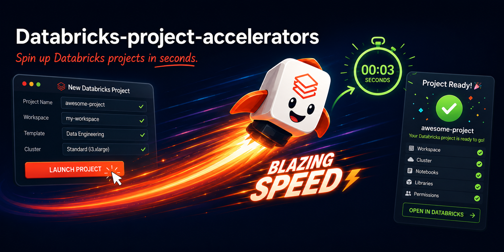

# Databricks Project Accelerators



CLI tool that scaffolds production-ready Databricks solutions via Jinja2 templates and Databricks Asset Bundles.

**[Documentation](https://pegodk.github.io/databricks-project-accelerators/)**

## Installation

```bash
pip install databricks-project-accelerators
```

Or with uv:

```bash
uv pip install databricks-project-accelerators
```

## Usage

```bash
# List available accelerators
dpa list

# Scaffold a project
dpa init medallion-sdp

# Deploy to Databricks
cd medallion-sdp
databricks bundle deploy --target dev
```

## Accelerators

| Name | Description |
|------|-------------|
| `medallion-sdp` | Streaming Delta Pipeline (DLT) with bronze/silver/gold layers and a DAB job |
| `medallion-spark` | Medallion architecture using Spark Structured Streaming notebooks |
| `app-streamlit` | Databricks-hosted Streamlit app wired to a SQL warehouse |
| `ai-bi` | Lakeview dashboard + Genie Space with metric views over the TPCH sample dataset |

## Requirements

- Python 3.10+
- [Databricks CLI](https://docs.databricks.com/dev-tools/cli/install.html) configured against a Unity Catalog workspace
