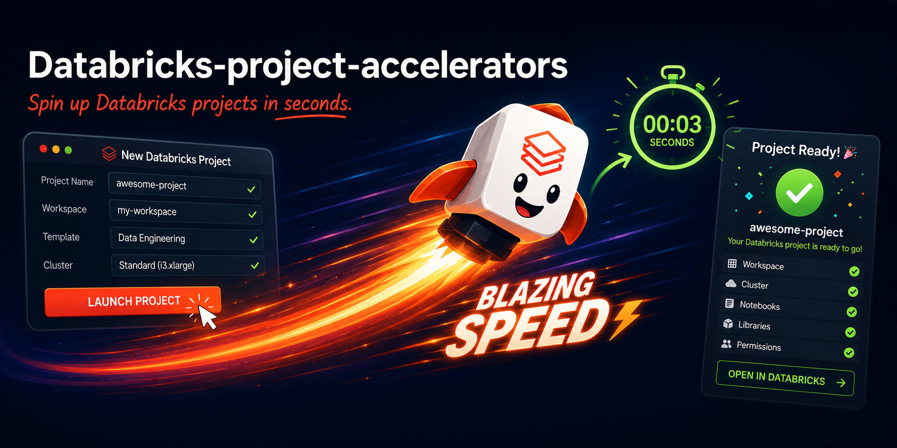

# Databricks Project Accelerators



A CLI tool that scaffolds production-ready Databricks solutions via Jinja2 templates and Databricks Asset Bundles.

## Quickstart

Open an empty folder in VS Code, then run in the terminal:

```bash
pip install databricks-project-accelerators

dpa list                    # browse available accelerators
dpa init medallion-sdp      # scaffold a project

cd medallion-sdp
databricks bundle deploy    # deploy to your workspace
databricks bundle run medallion_sdp_job
```

## Available accelerators

| Accelerator | What you get |
|---|---|
| [`medallion-sdp`](accelerators/medallion-sdp.md) | Delta Live Tables pipeline — declarative bronze/silver/gold with data quality constraints |
| [`medallion-dbt`](accelerators/medallion-dbt.md) | dbt SQL models — bronze views, silver joins, gold aggregates, run via native dbt_task |
| [`mlflow-project`](accelerators/mlflow-project.md) | MLflow training pipeline — experiment tracking, model registry, batch scoring |
| [`lakebase-streamlit-app`](accelerators/lakebase-streamlit-app.md) | Databricks App (Streamlit) wired to a SQL warehouse, plus Lakebase Postgres master data |
| [`custom-python-wheel`](accelerators/custom-python-wheel.md) | Custom Python wheel package with a build-and-upload job and an import verification task |
| [`ai-bi`](accelerators/ai-bi.md) | Lakeview dashboard + Genie Space with a metric view over the TPCH sample dataset |

See [Getting Started](getting-started.md) for a full walkthrough including authentication, environment targeting, and variable overrides.
